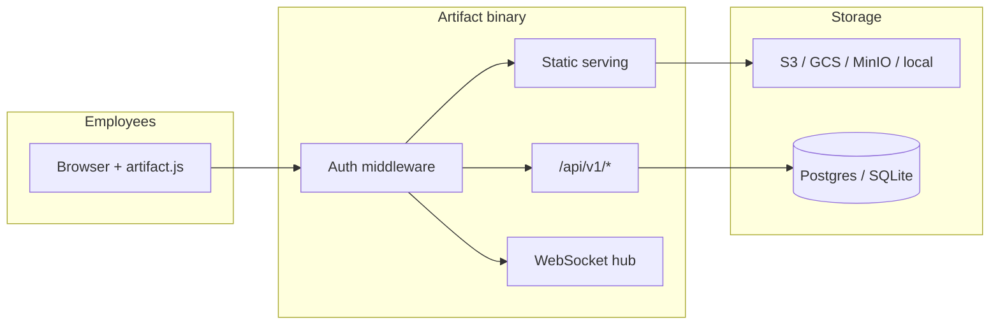

# Artifact

**Open-source internal hosting platform** — drop a folder of HTML, get a live internal URL with database, AI, files, websockets, warehouse queries, and Slack notifications. No API keys in client code. One binary.

Inspired by [Shopify's Quick](https://shopify.engineering/quick); built so every company can run their own trust bubble on Okta + their own cloud.

## 60-second quickstart

```bash
curl -fsSL https://raw.githubusercontent.com/siddharthsambharia-portkey/artifacts/main/scripts/install.sh | sh
artifact dev
```

In another terminal:

```bash
artifact init my-poll
cd my-poll
# edit index.html — or let your agent do it
artifact deploy
open http://my-poll.localhost:8443
```

Or skip the CLI: open `http://localhost:8443` and drag a folder onto the page.

## Features

| Capability | API |
|---|---|
| Static hosting | `artifact deploy` → `mysite.artifact.corp.com` |
| Drop to deploy | drag a file, folder, or zip onto the home page |
| Deploy API | `POST /api/v1/deploy` (multipart `files` or `zip`) |
| Database + realtime | `artifact.db.collection('x').create/subscribe` |
| Key-value | `artifact.kv.set(k, v)` / `artifact.kv.get(k)` |
| File uploads | `artifact.files.upload(file)` |
| AI chat + images | `artifact.ai.chat()` / `artifact.ai.image()` |
| Warehouse SQL | `artifact.warehouse.query('SELECT …')` |
| WebSockets | `artifact.ws.room('lobby')` |
| Identity | `artifact.me` |
| Slack | `artifact.notify.slack('#channel', 'msg')` |
| Agent skills | `artifact init` drops `AGENTS.md` + `CLAUDE.md` |
| MCP server | `artifact mcp` |

## Architecture



One Go binary. Wildcard DNS `*.artifact.corp.com` → Artifact. A **2 vCPU / 4 GB VM** comfortably serves a 5,000-person company.

## Deploy at your company

| Recipe | Path |
|---|---|
| Docker Compose (dev/demo) | `deploy/docker-compose.yml` |
| Kubernetes + Helm | `deploy/helm/artifact/` |
| GCP + Okta Helm profile | `deploy/helm/artifact/values-gcp.yaml` |
| GCP starter (GCS + Cloud SQL) | `deploy/terraform/gcp/main.tf` |
| AWS starter (S3 + RDS) | `deploy/terraform/aws/main.tf` |
| Okta OIDC | `docs/auth-okta.md` |
| Wildcard TLS (cert-manager, GCP) | `deploy/recipes/wildcard-tls-gcp.md` |
| Header-trust (Pomerium) | `deploy/recipes/pomerium.md` |

Terraform examples are starting points — add load balancers, networking, and your identity proxy per your org.

## Documentation

Full docs live in [`docs/`](docs/) — start at the [documentation index](docs/README.md).

| Topic | Doc |
|---|---|
| Build a site in 60 seconds | [Quickstart](docs/quickstart.md) |
| The model (trust bubble, constraints) | [Concepts](docs/concepts.md) |
| Every `artifact.*` method | [SDK reference](docs/sdk-reference.md) |
| Every CLI command | [CLI reference](docs/cli-reference.md) |
| All `artifact.yaml` fields | [Configuration](docs/configuration.md) |
| Deploy at your company | [Self-hosting](docs/self-hosting.md) |
| Choosing an auth mode | [Auth overview](docs/auth-overview.md) |
| Auth setup | [Okta](docs/auth-okta.md) · [Entra](docs/auth-entra.md) · [Google](docs/auth-google.md) · [header-trust](docs/auth-header-trust.md) |
| AI provider wiring | [AI gateway](docs/ai-gateway.md) |
| Read-only SQL | [Warehouse](docs/warehouse.md) |
| Governance, quotas, admin | [Governance & admin](docs/governance-and-admin.md) |
| Why no custom backends? | [FAQ](docs/faq.md) |

Building sites with a coding agent? The skill in [`skills/`](skills/) is dropped into every
`artifact init` project. Deploying Artifact with an agent? See the operator playbook at
[`AGENTS.md`](AGENTS.md) / [`CLAUDE.md`](CLAUDE.md).

## Development

```bash
make dev      # local server, SQLite, fake auth
make build    # compile binary
make test     # unit tests
make sdk      # build artifact.js
```

Copy `.env.example` to `.env` for the environment variables Artifact reads (OIDC/AI/warehouse/Slack secrets and config overrides). All values there are placeholders.

## Examples

| Example | Features |
|---|---|
| [guestbook](examples/guestbook/) | db + identity |
| [live-poll](examples/live-poll/) | db + subscribe |
| [team-dashboard](examples/team-dashboard/) | warehouse |
| [multiplayer-cursors](examples/multiplayer-cursors/) | ws + presence |
| [lunch-vote](examples/lunch-vote/) | db + ws + slack |

## License

Apache-2.0 — see [LICENSE](LICENSE).
